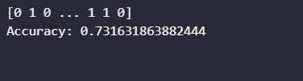
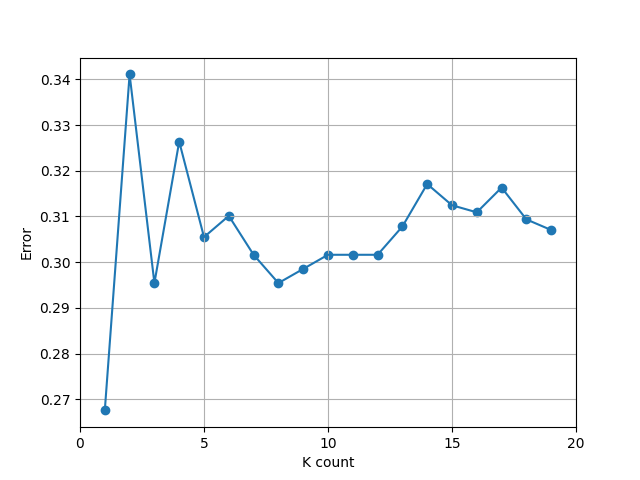

# 机器学习 课程报告1: kNN算法

黄婧媛 21300246010

## 1. 任务描述

利用Python的Scikit-learn库中的kNN算法，分析和推测葡萄酒的质量。   
（数据来源：https://www.kaggle.com/shelvigarg/wine-quality-dataset/ ）

## 2. 数据集描述

这一份从Kaggle得到的葡萄酒数据集，一共有6497个样本，12个特征（其中11个葡萄酒的理化性质，quality是葡萄酒的品质）。

## 3.1 数据预处理

**预处理1：** 检查数据集的完整性。将有缺失值的样本删除，并重置索引数。

```python
df.isnull().sum()
df.dropna(inplace=True)Y=df['quality'].apply(lambda x: 1 if x > 5 else 0 )
df.reset_index(drop=True)
```

**预处理2：** 将'type'的值从'red'与'white'改为使用数字'1'和'10'代表。

```python
X=df.drop(['quality'], axis=1)
X['type'] = X['type'].apply(lambda x: 1 if x == 'white' else 10)
```

**预处理3：** 将'quality'的值修改为: >5的值统一为1, <5的值统一为0。

```python
Y=df['quality'].apply(lambda x: 1 if x > 5 else 0 )
```

## 3.2 kNN算法原理

K最近邻（kNN）算法是一种可以用于基本分类和回归的方法。其的核心思想是：如果在一个样本在特征空间中的k个最相邻的样本中的大多数属于某一个类别，则该样本也属于这个类别，并具有该类别上样本的特征。该方法在确定分类决策上，只依据最近邻的一个或几个样本的类别来决定待分样本所属的类别。

## 3.3 kNN算法实现

kNN算法的实现分为以下几个步骤：

1. 计算未知样本与每个训练样本之间的距离
2. 按照得出的距离递增次序排序
3. 选取与当前样本距离最小的k个样本
4. 确定前k个样本所在类别的出现频率
5. 返回前k个样本出现频率最高的类别作为当前样本的预测分类

kNN算法的代码实现：

```python
#找出最优的k值
from sklearn.neighbors import KNeighborsClassifier
from sklearn import metrics

Y=[]

for i in range(1, 20):
    knn = KNeighborsClassifier(n_neighbors=i)
    KNN=knn.fit(X_train,Y_train)
    prediction=KNN.predict(X_test)
    accuracy = metrics.accuracy_score(Y_test,prediction)
    print("K={} accuracy: {}".format(i, accuracy))
    Y.append(1 - accuracy)   
```

## 4. 实验结果分析

### 4.1 评价指标

在这个模型里，我使用了sklearn里的`accuracy`作为评估模型性能的指标。`accuracy`指的是模型正确预测的样本数占总样本数的比例。

```python
accuracy = metrics.accuracy_score(Y_test,prediction)
```

### 4.2 结果

如下图所示，当k=1时，模型的定量评价结果accuracy = 0.7316



下图也展示了，当k=1时，计算得出error的值最小。


## 5. 总结

- kNN算法是一个简单的机器学习算法，不需要亲自训练模型，而是通过计算已知类别数据集中的点与当前点之间的距离，选取距离最近的k个点，确定前k个点的出现频率，用来预测当前点的类别。
- 不同的k的选取会对分类结果产生影响。此次实验中，我选择了k=1，因此模型预测的准确率为 73.16%
