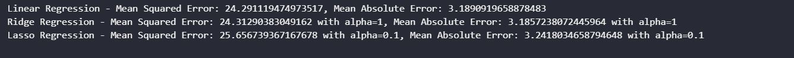
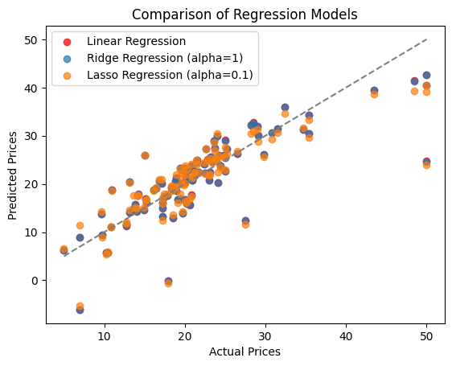

# 机器学习 课程报告2: 回归模型

黄婧媛 21300246010

## 1. 任务描述

根据波士顿房价数据集设计不同的回归模型来预测房价。此次任务中使用了线性回归、岭回归和拉索回归模型。
（数据来源：https://www.kaggle.com/datasets/vikrishnan/boston-house-prices）

## 2. 数据集描述

这一份从Kaggle得到的波士顿房价数据集，一共有505个样本，14个特征。
特征信息：

- `ZN`：划为 25,000 平方英尺以上地块的住宅用地比例。
- `INDUS`：每个城镇非零售商业用地的比例
- `CHAS`：查尔斯河虚拟变量（=1，如果小区内有河流，否则为 0）
- `NOX`：一氧化氮浓度（千万分率）
- `RM`：每套住宅的平均房间数
- `AGE`：1940 年以前建造的业主自住单位比例
- `DIS`：到波士顿五个就业中心的加权距离
- `RAD`：放射状高速公路的可达性指数
- `TAX`：每 10,000 美元的房产税全额税率
- `PTRATIO`：各城镇的学生与教师比率 12. B：1000(Bk-0.63)2，其中 Bk 为各城镇黑人比例 13. LSTAT：地位较低人口的百分比
- `MEDV`：以千美元为单位的自有住房中位值

## 3.1 数据预处理

**预处理1：** 原始数据集里并没有各个列的名称，因为为特征添加列名。

```python
names = ['CRIM', 'ZN', 'INDUS', 'CHAS', 'NOX', 'RM', 'AGE', 'DIS', 'RAD', 'TAX', 'PTRATIO', 'B', 'LSTAT', 'MEDV']
df = pd.read_csv(filename, delim_whitespace=True, names=names)
```

**预处理2：** 检查数据集的完整性。将有缺失值的样本删除，并重置索引数。

```python
df.isnull().sum()
df.dropna(inplace=True)
df.reset_index(drop=True)
```

**预处理3：** 对特征进行标准化处理，将特征的平均值重新调整为 0，标准差重新调整为 1。

```python
scaler = StandardScaler()
X_train_scaled = scaler.fit_transform(X_train)
X_test_scaled = scaler.transform(X_test)
```

## 3.2 回归模型的算法原理

#### 3.2.1 线性回归算法原理

线性回归是一种用于建模和分析两个变量之间关系的线性方法。其中一个变量被认为是因变量，另一个被认为是自变量。线性回归假设两个变量之间存在线性关系，通过拟合一条直线来描述这种关系。这条直线的方程可以表示为：$y=mx+b$。其中：

- $y$    是因变量（要预测的变量），
- $x$ 是自变量（用于预测的变量），
- $m$ 是直线的斜率，
- $b$ 是直线的截距。
  线性回归的目标是找到最佳的斜率 $m$ 和截距 $b$，使得预测值与实际观测值之间的误差最小。这通常通过最小化平方误差来实现，即最小化实际观测值与预测值之间的差的平方和。

#### 3.2.2 岭回归算法原理

岭回归（Ridge Regression）是一种用于处理多重共线性问题的线性回归扩展方法。多重共线性指的是自变量之间存在高度相关性的情况，这可能导致线性回归模型的不稳定性和高方差。岭回归通过引入正则化项来解决这个问题，使得模型对于自变量中的噪音不敏感。

岭回归的损失函数为：${J(\beta)​=MSE + \alpha \sum^n_{i=1} \beta^2_i}$

其中：

- $J(β)$ 是岭回归的损失函数，
- MSE 是均方误差（Mean Squared Error），用来衡量模型的预测误差
- α 是正则化参数，控制了正则化项的强度
- $\beta_i$ 是模型的系数，需要被学习。

岭回归的优化目标是最小化损失函数 $J(\beta)$。通过调整正则化参数$\alpha$，可以控制模型对正则化项的敏感性，进而平衡模型对训练数据的拟合和对系数的大小的控制。

#### 3.2.3 拉索回归算法原理

拉索回归是一种线性回归的变体，通过在损失函数中添加L1正则化项来实现特征选择和防止过拟合。L1正则化项是系数的绝对值之和，通过最小化损失函数和正则化项的和来得到稀疏的系数向量。拉索回归的损失函数定义为：${J(\beta)=MSE + \alpha \sum^n_{i=1}|\beta_i|}$。 其中:

- $J(\beta)$ 是拉索回归的损失函数
- $MSE$ 是均方误差（Mean Squared Error），用来衡量模型的预测误差
- $\alpha$ 是正则化参数，控制了正则化项的强度
- $\beta_i$ 是模型的系数，需要被学习。

与岭回归不同，拉索回归的正则化项是系数的绝对值之和。这使得在优化过程中，某些系数可能变得刚好等于零，从而实现了特征的选择。

## 3.3 回归模型的算法实现

#### 3.3.1 线性回归算法实现

线性回归的实现步骤如下：

1. 定义模型： 假设因变量 $y$ 与自变量 $x$ 之间存在线性关系，即 $y=mx+b$。

2. 确定参数： 寻找最佳的斜率 $m$ 和截距 $b$，使得模型最好地拟合数据。这通常通过最小化平方误差（最小二乘法）来实现。

3. 拟合模型： 使用训练数据来确定模型的参数，使得模型能够很好地适应数据。

4. 预测： 使用训练好的模型对新的自变量值进行预测。

5. 评估模型： 通过比较模型的预测值与实际观测值来评估模型的性能。常见的评估指标包括均方误差（Mean Squared Error，MSE）。

使用了scikit-learn库代码实现线性回归：

```python
linear_reg_model = LinearRegression()
linear_reg_model.fit(X_train_scaled, Y_train)

# Predictions
Y_pred_linear = linear_reg_model.predict(X_test_scaled)

# Evaluate the model
mse_linear = mean_squared_error(Y_test, Y_pred_linear)
mae_linear = mean_absolute_error(Y_test,Y_pred_linear)
```

#### 3.3.2 岭回归算法实现

岭回归的实现步骤如下：

1. 定义模型：岭回归的模型与线性回归的模型相似（请参考3.3.1），但包含了正则化项。
2. 定义损失函数：岭回归的损失函数是均方误差（MSE）和正则化项的和。
   损失函数：${J(\beta)​=MSE + \alpha \sum^n_{i=1} \beta^2_i}$
   ​3. 添加正则化项：正则化项限制了模型参数的大小，有助于处理多重共线性问题。$\alpha$ 是正则化参数，控制正则化项的强度。较大的 $\alpha$ 会导致更强的正则化。
3. 选择优化算法：岭回归的参数可以通过梯度下降等优化算法进行学习。
4. 训练模型：使用训练数据来拟合模型，即找到最优的系数 $\beta$。
5. 预测和评估模型。

使用了scikit-learn库代码实现岭回归：

```python
ridge_reg_model = Ridge()
param_grid = {'alpha': [0.1, 1, 10, 100]}
grid_search_ridge = GridSearchCV(ridge_reg_model, param_grid, cv=5, scoring='neg_mean_squared_error')
grid_search_ridge.fit(X_train_scaled, Y_train)

# Best hyperparameter
best_alpha_ridge = grid_search_ridge.best_params_['alpha']

# Predictions
Y_pred_ridge = grid_search_ridge.predict(X_test_scaled)

# Evaluate the model
mse_ridge = mean_squared_error(Y_test, Y_pred_ridge)
mae_ridge = mean_absolute_error(Y_test,Y_pred_ridge)
```

#### 3.3.3 拉索回归算法实现

拉索回归的实现步骤如下：

1. 定义模型：拉索回归的模型与线性回归的模型相似（请参考3.3.1），但包含了L1正则化项。
2. 定义损失函数：拉索回归的损失函数是均方误差(MSE)和L1正则化项的和。损失函数：${J(\beta)​=MSE + \alpha \sum^n_{i=1} \beta^2_i}$
3. 添加L1正则化项：L1正则化项的引入是拉索回归的关键。它通过对系数的绝对值进行惩罚，推动模型系数向零。$\alpha$ 是正则化参数，控制L1正则化项的强度。
4. 选择优化算法：拉索回归的参数可以通过梯度下降、坐标下降等优化算法进行学习。
5. 训练模型：使用训练数据来拟合模型，即找到最优的系数 $\beta$。
6. 预测和评估模型。

使用了scikit-learn库代码实现拉索回归：

```python
# Create and train the Lasso Regression model with hyperparameter tuning
lasso_reg_model = Lasso()
param_grid = {'alpha': [0.1, 1, 10, 100]}
grid_search_lasso = GridSearchCV(lasso_reg_model, param_grid, cv=5, scoring='neg_mean_squared_error')
grid_search_lasso.fit(X_train_scaled, Y_train)

# Best hyperparameter
best_alpha_lasso = grid_search_lasso.best_params_['alpha']

# Predictions
Y_pred_lasso = grid_search_lasso.predict(X_test_scaled)

# Evaluate the model
mse_lasso = mean_squared_error(Y_test, Y_pred_lasso)
mae_lasso = mean_absolute_error(Y_test, Y_pred_lasso)
```

## 4. 实验结果分析

### 4.1 评价指标

在这三个回归模型里，都使用了sklearn里的`mean_squared_error`和`mean_absolute_error`作为评估模型性能的指标。`mean_squared_error` 指的是均方误差（MSE）的函数，它衡量模型预测值与实际观测值之间的平方差的平均值；`mean_absolute_error` 指的是平均绝对误差（MAE）的函数，它衡量模型预测值与实际观测值之间的绝对差的平均值。


### 4.2 结果
模型的评估结果和预测结果如下图所示：

