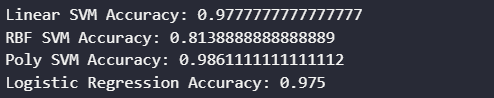
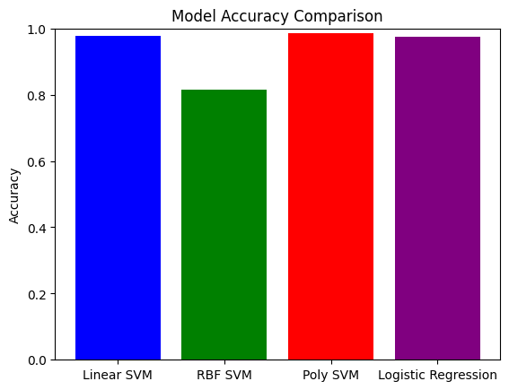

# 机器学习 课程报告3： 支持向量机

黄婧媛 21300246010

## 1. 任务描述

- 基于 MNIST 数据集，使用 SVM 分类器对手写数字进行分类：需要尝试不同的核，为每种核类型找到最佳超参数设置（包括核参数和正则化参数）。
- 尝试使用其他的分类算法：此次实验中，另外采用了逻辑回归对手写数字进行分类。

## 2. 数据集描述

MNIST手写数字数据库中包含了一个由60，000个样本组成的训练集`mnist_trainset` 和一个由10，000个样本组成的测试集 `mnist_testset` 。数据集里包含了从 0 到 9 的手绘数字灰度图像。每幅图像高 28 像素，宽 28 像素，共计 784 像素。每个像素都有一个像素值，表示该像素的明暗程度，数值越大表示越暗。这个像素值是介于 0 和 255 之间的整数，包括 0 和 255。

## 3.1 数据预处理

**预处理1：** 将图像平铺，因为 scikit-learn 库的 SVM 模型将一维数组作为输入。

```python
n_samples = len(digits.images)
data = digits.images.reshape((n_samples, -1))
```

**预处理2：** 将数据分为训练集和测试集。

```python
X=data
y=digits.target
X_train, X_test, y_train, y_test = train_test_split(X, y, test_size=0.2, random_state=42)
```

**预处理3：** 使用 PCA 将特征数量减少到 2 个。

```python
pca = PCA(n_components=2)
X_train_pca = pca.fit_transform(X_train)
X_test_pca = pca.transform(X_test)
```

## 3.2 支持向量机的原理

支持向量机（Support Vector Machine，SVM）是一种用于分类和回归分析的监督学习模型。 SVM的核心思想是在特征空间中找到一个超平面，将不同类别的数据点分开，并使得两个类别之间的间隔最大化。这个超平面被称为“决策边界”或“分离超平面”。

- 在SVM中，支持向量是离分离超平面最近的那些数据点。这些支持向量决定了超平面的位置。改变这些支持向量的位置不会影响超平面的位置，只有在它们的外面加入新的支持向量，才有可能改变超平面的位置。
- SVM可以通过核函数来处理非线性可分的数据集。核函数将原始特征映射到一个高维空间，使得在该空间中数据变得线性可分。常用的核函数包括线性核、多项式核和径向基函数（RBF）核。
- SVM中的正则化参数（通常用C表示）用于平衡最大化间隔和减小误分类的损失。较大的C值会导致更少的误分类但可能导致过拟合，而较小的C值会导致更大的间隔但可能增加误分类。

## 3.3 支持向量机的实现

支持向量机的实现步骤如下：

1. 选择核函数：核函数是SVM的关键组成部分，用于将数据映射到高维空间。常见的核函数包括线性核、多项式核和径向基函数（RBF）核。选择适当的核函数取决于数据的性质。
2. 选择正则化参数：正则化参数（通常用C表示）用于平衡最大化间隔和减小误分类的损失。通过交叉验证等方法选择适当的正则化参数。
3. 使用SVM库实例化SVC(Support Vector Classification)对象，用于构建模型，并使用选择的核函数和参数进行模型训练。
4. 进行预测和模型评估。

```python
def svm_grid_search(kernel, param_grid):
    svc = SVC(kernel=kernel)
    grid_search = GridSearchCV(svc, param_grid, cv=5, n_jobs=-1)
    grid_search.fit(X_train, y_train)
    return grid_search

param_grid_linear = {'C': [0.1, 1, 10, 100]}
param_grid_rbf = {'C': [0.1, 1, 10, 100], 'gamma': [0.01, 0.1, 1, 10]}
param_grid_poly = {'C': [0.1, 1, 10, 100], 'degree': [2, 3, 4], 'coef0': [0, 1, 2]}    

linear_svm = svm_grid_search('linear', param_grid_linear)
rbf_svm = svm_grid_search('rbf', param_grid_rbf)
poly_svm = svm_grid_search('poly', param_grid_poly)

y_pred_linear = linear_svm.predict(X_test)
y_pred_rbf = rbf_svm.predict(X_test)
y_pred_poly = poly_svm.predict(X_test)

accuracy_linear = accuracy_score(y_test, y_pred_linear)
accuracy_rbf = accuracy_score(y_test, y_pred_rbf)
accuracy_poly = accuracy_score(y_test, y_pred_poly)
```

## 3.3 逻辑回归的原理

逻辑回归是一种用于二分类问题的统计学习方法，它的主要思想是通过一个称为逻辑函数（logistic function）或 Sigmoid 函数的非线性函数来建模概率。

- 逻辑回归使用逻辑函数将线性模型的输出映射到[0, 1]之间。逻辑函数的表达式为：$g(z) = \frac{1}{1+e^{-z}}$ 

## 3.4 逻辑回归的实现

逻辑回归的实现步骤如下：

1. 使用scikit-learn库中的LogisticRegression构建模型
2. 通过交叉验证选出最优参数来训练模型
3. 进行预测和评估模型

```python
param_grid_logreg = {'C': [0.001, 0.01, 0.1, 1, 10, 100]}
logreg = LogisticRegression(max_iter=1000)
grid_search_logreg = GridSearchCV(logreg, param_grid_logreg, cv=5, n_jobs=-1)
grid_search_logreg.fit(X_train, y_train)

y_pred_logreg = grid_search_logreg.predict(X_test)
accuracy_logreg = accuracy_score(y_test, y_pred_logreg)

```


## 4. 实验结果分析

### 4.1 评价指标

使用的评估指标是准确率`accuracy`。准确率衡量的是正确分类的样本占样本总数的比例。

### 4.2 结果

使用不同核函数的SVM和逻辑回归来分类手写数字的准确率如下图所示。其中，多项式核SVM的准确率最高，是0.986。

 
