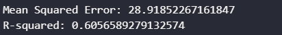
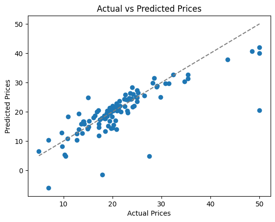

# 机器学习 课程报告4： 支持向量回归

黄婧媛 21300246010

## 1. 任务描述

根据波士顿房价数据集，使用支持向量回归模型来预测房价。
（数据来源：https://www.kaggle.com/datasets/vikrishnan/boston-house-prices）

## 2. 数据集描述

这一份从Kaggle得到的波士顿房价数据集，一共有505个样本，14个特征。
特征信息：

- `ZN`：划为 25,000 平方英尺以上地块的住宅用地比例。
- `INDUS`：每个城镇非零售商业用地的比例
- `CHAS`：查尔斯河虚拟变量（=1，如果小区内有河流，否则为 0）
- `NOX`：一氧化氮浓度（千万分率）
- `RM`：每套住宅的平均房间数
- `AGE`：1940 年以前建造的业主自住单位比例
- `DIS`：到波士顿五个就业中心的加权距离
- `RAD`：放射状高速公路的可达性指数
- `TAX`：每 10,000 美元的房产税全额税率
- `PTRATIO`：各城镇的学生与教师比率 12. B：1000(Bk-0.63)2，其中 Bk 为各城镇黑人比例 13. LSTAT：地位较低人口的百分比
- `MEDV`：以千美元为单位的自有住房中位值

## 3.1 数据预处理

**预处理1：** 原始数据集里并没有各个列的名称，因为为特征添加列名。

```python
names = ['CRIM', 'ZN', 'INDUS', 'CHAS', 'NOX', 'RM', 'AGE', 'DIS', 'RAD', 'TAX', 'PTRATIO', 'B', 'LSTAT', 'MEDV']
df = pd.read_csv(filename, delim_whitespace=True, names=names)
```

**预处理2：** 检查数据集的完整性。将有缺失值的样本删除，并重置索引数。

```python
df.isnull().sum()
df.dropna(inplace=True)
df.reset_index(drop=True)
```

**预处理3：** 对特征进行标准化处理，将特征的平均值重新调整为 0，标准差重新调整为 1。

```python
scaler = StandardScaler()
X_train_scaled = scaler.fit_transform(X_train)
X_test_scaled = scaler.transform(X_test)
```

## 3.2 支持向量回归原理

支持向量回归(SVR)是一种基于支持向量机的回归方法。SVR 的目标是找到一个函数，该函数与数据之间的差异在一定的容忍度范围内最小化。它的具体原理如下：

- 回归问题的表述： 考虑一个回归问题，其中我们希望找到一个函数$f(x)$，其中x是输入特征，$f(x)$是对应的输出。回归问题的目标是最小化预测值与实际值之间的误差。
- 间隔和容忍度： 与分类问题类似，SVR 引入了间隔的概念。在回归中，我们希望预测值与真实值之间的差异在一定的容忍度$\epsilon$内。间隔表示在容忍度范围内的误差。
- 支持向量： 在SVR中，支持向量是训练数据集中对模型产生影响的点。这些是最靠近决策边界（在回归中是拟合曲线）的数据点。支持向量在定义间隔和拟合函数时起着关键作用。
- 核函数： SVR使用核函数来将输入特征映射到高维空间。这允许SVR在非线性问题上进行建模，捕捉更复杂的关系。
- 优化目标： SVR的目标是最小化间隔以及超过容忍度的数据点的误差。这可以通过优化一个损失函数来实现，该损失函数包括了间隔和误差。

## 3.3 支持向量回归实现

支持向量回归的实现步骤如下：

1. 定义模型
2. 选择核函数和参数：需要选择适当的核函数，例如线性核（'linear'）、多项式核（'poly'）或径向基函数核（'rbf'）。还需要调整相应的超参数，如C、$\epsilon$等。这需要通过交叉验证等方法进行调整。
3. 拟合模型： 使用训练数据来确定模型的参数，使得模型能够很好地适应数据。
4. 预测： 使用训练好的模型对新的自变量值进行预测。
5. 评估模型： 通过比较模型的预测值与实际观测值来评估模型的性能。常见的评估指标包括均方误差（Mean Squared Error，MSE）。

使用了scikit-learn库代码实现支持向量回归：

```python
svr = SVR(kernel='linear', C=1.0)
svr.fit(X_train_scaled, y_train)

y_pred = svr.predict(X_test_scaled)

mse = mean_squared_error(y_test, y_pred)
r2 = r2_score(y_test, y_pred)
```

## 4. 实验结果分析

### 4.1 评价指标

我使用了sklearn里的`mean_squared_error`和`r2`作为评估支持向量回归模型性能的指标。`mean_squared_error` 指的是均方误差（MSE）的函数，它衡量模型预测值与实际观测值之间的平方差的平均值；`r2_score`称为决定系数（Coefficient of Determination）。决定系数是一个介于0和1之间的值，表示模型对目标变量方差的解释程度。具体来说，决定系数（R-squared）衡量了模型预测值与实际值之间的相似程度。其计算方式为：${R^2 = 1 - \frac{均方误差}{目标变量的总方差}}$

### 4.2 结果


