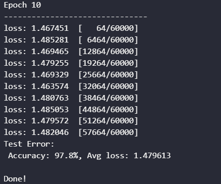
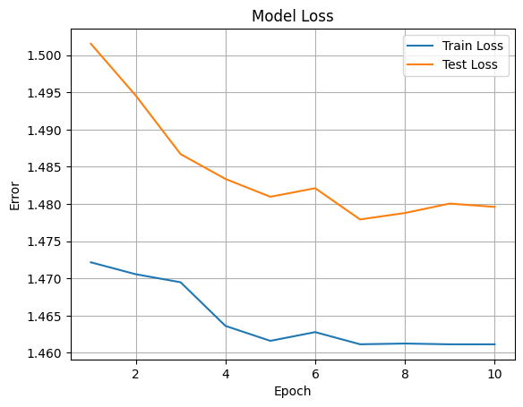

# 机器学习 课程报告5: MLP

黄婧媛 21300246010

## 1. 任务描述

从MNIST数据集中获取数字的图像，并利用PyTorch建立MLP模型，并且训练模型识别出该数字是什么。对于测试集中的每一个数字，都需要预测出正确的数字。

## 2. 数据集描述

MNIST手写数字数据库中包含了一个由60，000个样本组成的训练集`mnist_trainset` 和一个由10，000个样本组成的测试集 `mnist_testset` 。数据集里包含了从 0 到 9 的手绘数字灰度图像。每幅图像高 28 像素，宽 28 像素，共计 784 像素。每个像素都有一个像素值，表示该像素的明暗程度，数值越大表示越暗。这个像素值是介于 0 和 255 之间的整数，包括 0 和 255。

## 3.1 数据预处理

**预处理1：**
利用PyTorch的Torchivision API获取数据并且转换成PyTorch tensors。

```python
mnist_trainset = datasets.MNIST(root='./data', train=True, download=True, transform=ToTensor())
mnist_testset = datasets.MNIST(root='./data', train=False, download=True, transform=ToTensor())
```

**预处理2：**
将数据集中的图片可视化

```python
figure = plt.figure(figsize=(7, 7))
cols, rows = 5, 5

for i in range(1, cols * rows + 1):
    sample_idx = torch.randint(len(mnist_trainset), size=(1,)).item()
    img, label = mnist_trainset[sample_idx]
    figure.add_subplot(rows, cols, i)
    plt.axis("off")
    plt.imshow(img.squeeze(), cmap="gray")

plt.show() 
```

**预处理3：**
用`DataLoader`将数据集进行分批处理，以便之后遍历数据集做测试。

```python
loaded_train = DataLoader(mnist_trainset, batch_size=64)
loaded_test = DataLoader(mnist_testset, batch_size=64)
```

## 3.2 MLP算法原理

多层感知器(Multilayer Perceptron，简称MLP)是一种前馈神经网络模型，由多个神经元组成。MLP通常用于解决分类问题。MLP至少包括三个层次：输入层、隐藏层、和输出层。数据会正向流：输入层 -> 隐藏层 -> 输出层；MLP中的神经元则通过反向传播进行训练学习算法。

- 输入层会接受要处理的数据或信号
- 隐藏层负责计算
- 输出层负责进行预测的任务。
- 多层感知器中的神经元可以使用任意激活函数
- 反向传播允许多层感知器迭代地调整网络中的权重，直至获得最小化成本函数的权重。

**MLP的训练过程：**

1. 从输入层开始，将数据向前传播到输出层；

2. 根据输出，计算预测结果与已知结果之间的差异；

3. 反向传播差异，求其对网络中每个权重的导数，并更新模型。

4. 重复上面的三个步骤来学习训练优化算法。

## 3.3 MLP算法实现

利用PyTorch的`nn.Module`实现MLP模型

- 创建一个用于将输入展平的`Flatten`层，将28x28的图像展平成一维向量。
- 线性层`nn.Linear(28*28, 512)`，将展平后的输入大小转换为512。
- Dropout层`nn.Dropout(p=0.28)`，用于随机丢弃部分神经元，以防止过拟合。
- 输出层`（nn.Linear(512, 10)`，输出大小为10，表示10个类别。
- 最后一层使用Sigmoid激活函数`nn.Sigmoid()`

```python
class MLP(nn.Module):
    def __init__(self):
        super(MLP,self).__init__()
        self.flatten = nn.Flatten()
        self.linear=nn.Sequential(
            nn.Linear(28*28,512),
            nn.ReLU(),
            nn.Linear(512,512),
            nn.ReLU(),
            nn.Dropout(p=0.28),
            nn.Linear(512,10),
            nn.Sigmoid()   
        )
    def forward(self,x):
        x = self.flatten(x)
        out = self.linear(x)
        return out  

model = MLP().to(device)
```

对MLP模型添加`optimizer`和`loss function`

```python
loss_function = nn.CrossEntropyLoss()
optimizer = torch.optim.Adam(model.parameters(), lr=0.001) 
```

对模型进行训练以及测试

```python
def train(dataloader, loss_fn, optimizer):
    size = len(dataloader.dataset)
    model.train()
    for batch, (X, y) in enumerate(dataloader):
        X, y = X.to(device), y.to(device)
        pred = model(X.to('cuda'))
        loss = loss_fn(pred, y.to('cuda'))

        loss.backward()
        optimizer.step()
        optimizer.zero_grad()


        if batch % 100 == 0:
            loss, current = loss.item(), (batch + 1) * len(X)
            print(f"loss: {loss:>7f}  [{current:>5d}/{size:>5d}]")

    return loss.item() 

def test(dataloader, loss_fn):
    size = len(dataloader.dataset)
    num_batches = len(dataloader)
    model.eval()
    test_loss, correct = 0, 0

    with torch.no_grad():
        for X, y in dataloader:
            X, y = X.to(device), y.to(device)
            pred = model(X.to("cuda"))
            test_loss += loss_fn(pred, y.to('cuda')).item()
            correct += (pred.argmax(1) == y.to('cuda')).type(torch.float).sum().item()

    test_loss /= num_batches
    correct /= size
    print(f"Test Error: \n Accuracy: {(100*correct):>0.1f}%, Avg loss: {test_loss:>8f} \n")

    return test_loss      
```

## 4. 实验结果分析

### 4.1 评价指标

MNIST 数据集是一个手写数字数据集。因此在使用 MLP 处理该数据集时，使用的评估指标是准确率`accuracy`。准确率衡量的是正确分类的样本占样本总数的比例。

### 4.2 结果

在最后一次epoch中，模型测得的准确率是97.8%，平均损失时1.479613（如下图所示）。


MLP 模型的训练损耗`training_loss`和测试损耗`test_loss`则如下所示。


## 5. 总结

MLP是一个可以有效进行分类的神经网络模型。不同数量的层次和神经元、不同种类的激活函数以及优化器选择都会影响其结果。